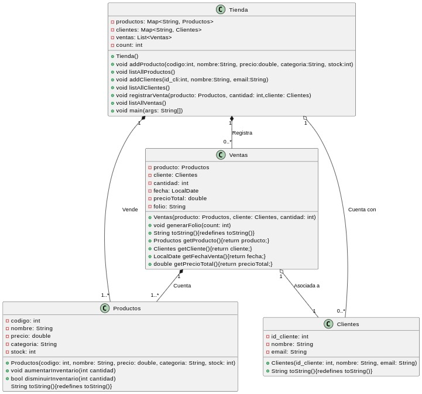

# Java Store

  

    

     <H3>¿Qué es Tienda Java?</H3>   
   

  

  

    

      
Es una práctica en Java dónde se nos explica que se necesita desarrolloar una aplicación
      de una tienda que registra ventas manualmente como práctica de la POO.

      
Se no solicita lo siguiente:

      <ul>
        <li>Registrar productos con su nombre, precio, categoría y stock.</li>
        <li>Administrar clientes con datos básicos como nombre y correo
            electrónico.</li>
        <li>Registrar ventas, indicando el producto vendido, la cantidad y
            asignando la compra a clientes registrados.</li>
        <li>Verificar disponibilidad de stock antes de completar una venta.</li>
        <li>Calcular el total de una venta basada en los precios de los
            productos.</li>
      </ul>
    
      
  

  

    

      
 Por lo que propusimos la siguiente disposición de clases elaborada en PlantUml

      
      
Los códigos de las clases se muestran en los siguientes elaces:

      <ul>
        <li>Clase: <a href="Productos.java">Productos.java</a></li>
        <li>Clase: <a href="Clientes.java">Clientes.java</a></li>
        <li>Clase: <a href="Ventas.java">Ventas.java</a></li>
        <li>Clase manejadora: <a href="Ventas.java">Ventas.java</a></li>
      </ul>
    

    

      

        <h3>Descripción de las clases utilizadas:</h3>
        <table>
          <thead>
            <tr styles="background-color:blue">
              <th>Clase</th>
              <th>Atributos y propiedades</th>
              <th>Métodos</th>
              <th>Descripción</th>
            </tr>
          </thead>
        </table>
      

    

  

